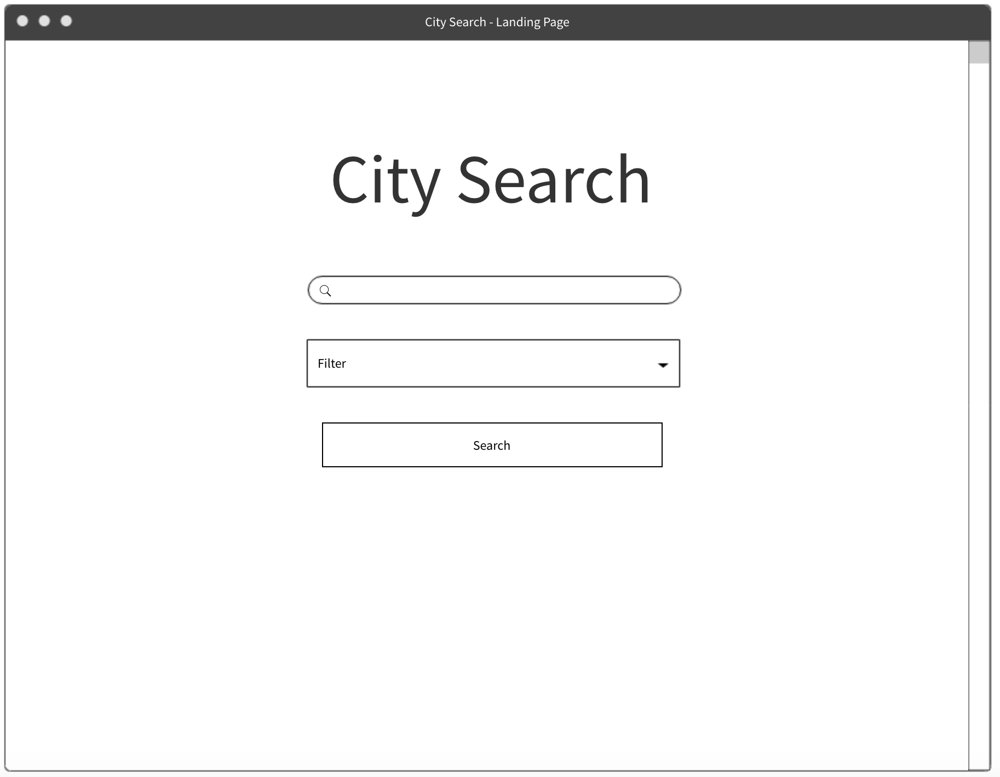
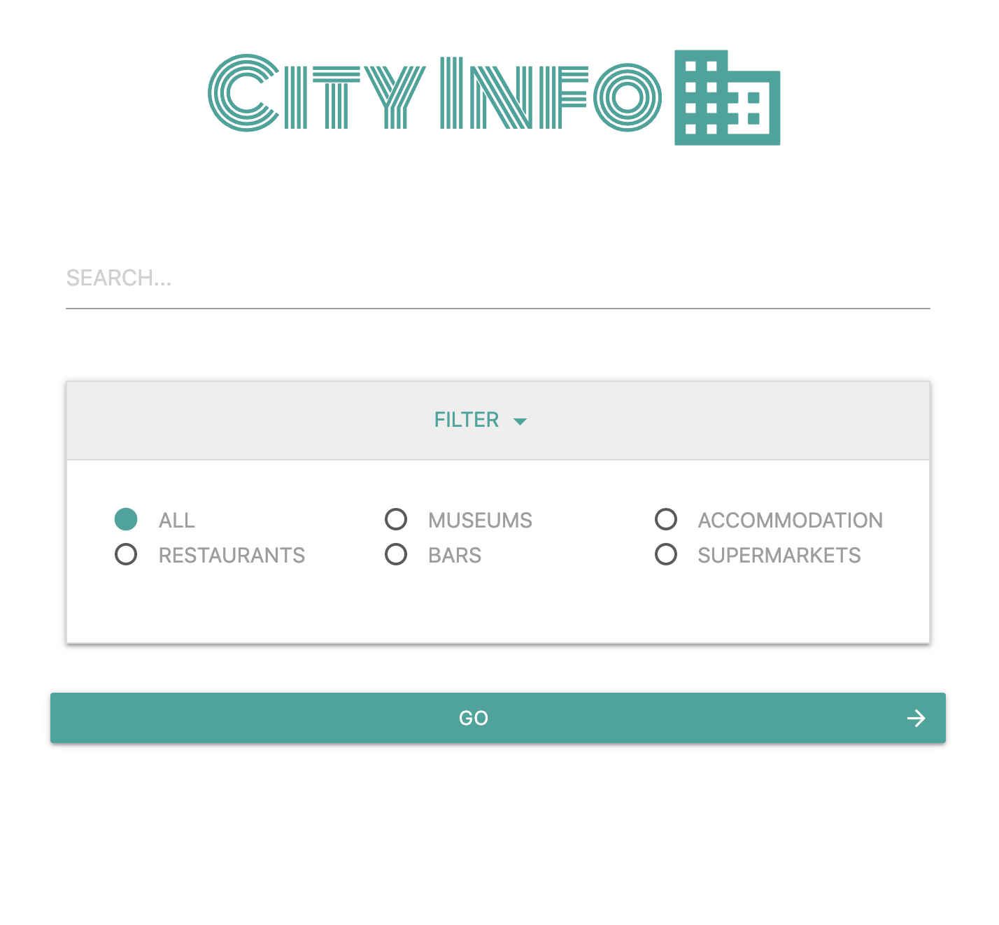
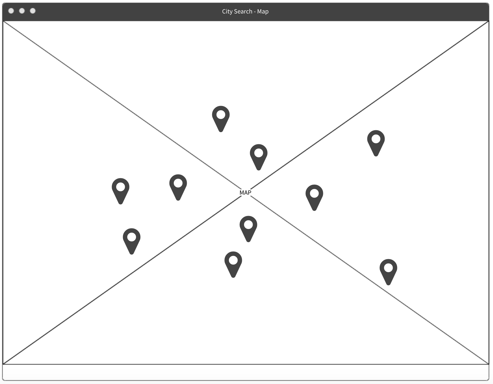
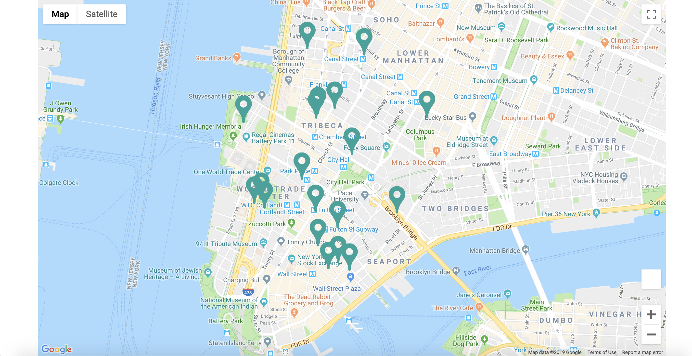
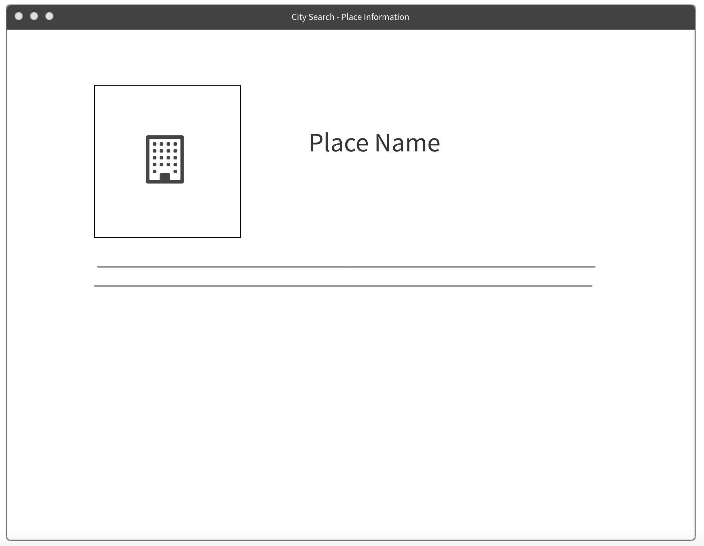
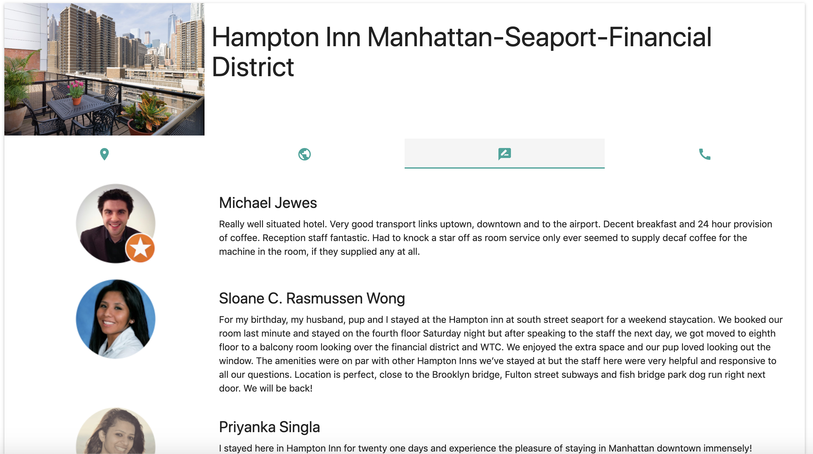

# CityInfo

A website that call on the Google Maps and Google Places API to allow users to search for different attractions within a city of their choice. 

With a simple to use layout and professional design the website allows users to search for the following attractions:

- Museums
- Accommodation
- Restaurants
- Bars
- Supermarkets

 
## UX

The aim for this project was to construct a website that was incredibly user friendly, but behind the surface used lots of interesting technologies to retrieve data and display them in a visually appealing manner. 

When designing the wireframes and mockups, it was clear that this project could be a one-page application consisting of three main sections on the page:

### 1. Search

When first loading the page, the user is directed to the search bar clearly. The layout is similar to that of the Google Search homepage (which all internet users are familiar with) making it clear what the user should do next. 

The name of the website changed from City Search to CityInfo as the project progressed. A dropdown filter allows the user to select different types to help them narrow down their search.

Use of the Materialize.css library transforms the elements on the page to be visually appealing. For example, the filter dropdown uses the `collapsible` class. The buttons also use the `waves-effect` class for an elegant transition when clicking.

### 2. Map

It was important to make the map take up as much of the screen as possible to maximise the search results displayed to the user for the searched city. This is shown in the mockups and in the final piece. The map is displayed full screen on all screen sizes.

Pressing the 'GO' button auto-scrolls the user to the map section of the page. The map is then rendered with API calls (explained further in a later section of this README document). The map marker (in SVG format to allow the map to show behind holes in the icon) overlays the map object, and a Materialize `toast` prompts the user to click icons to reveal more information.

### 3. Place Information

The final section of the project outlines the details of the user selected map marker. 

A Materialize `card` element displays a photo of the selected place and is labelled with the place name. Using the Materialize `tabs` the user can easily switch between the four key details of the selected place:

    i. Address
    ii. Website
    iii. Reviews
    iv. Phone Number
    

## Features

As previously mentioned, the website uses the Materialize.css library to make elements on the page visually appealing. All the Materialize components are initialised with one function call `M.AutoInit();`. As multiple css components were used in the project, this method of initialisation was preferred over individual initialisation. With larger projects where page performance becomes more of an issue, this method could be changed to individual initialisation to boost performance.

In the search bar, the `google.maps.places.Autocomplete()` API helps the user identify a city to search for. The function takes a parameter to restrict the user to just search for cities in the search bar.

Once a city is selected and filters optionally applied, clicking the 'GO' button calls the `renderMap()` function, and the `scrollToId` function uses jQuery to redirect the user to the map section of the page.

The `google.maps.Geocoder` API takes the city the user has searched for in the autocomplete search bar and identifies the latitude and longitude coordinates. The map view is then set to those coordinates.

Next, any applied filters are added to the `request` object, and the `google.maps.places.PlacesService` API call is made. The `google.maps.places.nearbySearch(request, callback)` is then called. The `callback` function is taken as one of the arguments, which iterates through the results returned for that city and drops the map marker at the place location.

Finally, relevant information is obtained from the API city search results and populates each of the tabs in the place infortmation card at the bottom of the page when the user clicks on a map marker. Most of the details displayed are a one-to-one match i.e. only one website name, phone number etc. However, there could be multiple reviews for a returned place, so code was implemented to iterate through the reviews and display them.

### Features Left to Implement

- The website is a simple search site (which is exactly what was required from the brief), but it perhaps the next step would be to allow the user to save/favourite locations they like.

## Technologies Used

- [JQuery](https://jquery.com)
    - The project uses **JQuery** to simplify DOM manipulation - specific examples include collapsing of the navbar when the user is not at the top of the page, and the scroll-to-section functionality
    
- [Materialize.css](https://materializecss.com/)
    - The project uses the Materialize.css for styling purposes and achieving the grid layout
    
- [Google Fonts](https://fonts.google.com/)
    - The project used Google Fonts to beautify the typography

- [Google Places API](https://developers.google.com/maps/documentation/javascript/places)
    - This project uses the Google Places API to generate place information.

- [Google Maps API](https://developers.google.com/maps/documentation/javascript/tutorial)
    - This project uses the Google Maps API to render the map on the website.

- [Google Places Autocomplete API](https://developers.google.com/maps/documentation/javascript/examples/places-autocomplete)
    - This project uses the Google Places Autocomplete API to restrict and help the user to search for cities.

## Testing

1. ### Search

    1. Click on the search bar and enter 'London' - cities with 'London' in the name are suggested below the search bar
    2. Click on the search bar and enter 'Berlin' - cities with 'Berlin' in the name are suggested below the search bar
    3. Click on the search bar and enter 'France' - only cities with 'France' in the name are suggested (not countries)
    4. Click the filter dropdown and select 'BARS' - collapse and reopen the filter and check selection remains selected
    5. Click 'GO' with nothing in the search bar - alert flashes on screen prompting the user to enter a city in the search bar
    6. Enter a valid city in the search bar and apply a filter - screen slides down to rendered map automatically
    
2. ### Map

    (Pre-requisite: User has entered London in the search bar, applied the 'ACCOMMODATION' filter and clicked GO)
    
    1. Map object renders correctly and centers on London.
    2. Markers drop on the map with attractions that only relate to 'ACCOMMODATION'
    3. Markers display on the map outside of the zoomed viewport (dragging the map reveals them)
    
3. ### Place Information

    (Pre-requisite: User has entered London in the search bar, applied the 'ACCOMMODATION' filter, clicked GO, and selected a map marker ('The Royal Horseguards'))

    1. Clicking the map marker auto scrolls to the place information section of the page.
    2. Place information card is populated with the place photo and place title ('The Royal Horseguards').
    3. The address tab is populated with the address of the attraction ('2 Whitehall Ct, Westminster, London SW1A 2EJ, UK').
    4. The website tab is populated with a link to the correct website URL of the attraction ('https://www.guoman.com/en/london/the-royal-horseguards.html?utm_source=google&utm_medium=organic&utm_campaign=gmb_website_click').
    5. The reviews tab is populated with the most recent reviews for that attraction (verified by comparing with Google Maps search).
    6. The phone tab is populated with the correct phone number for the attraction ('0800 330 8090').
    
    
## Deployment

The code has been deployed to GitHub, and is hosted on GitHub Pages (https://neon-flights.github.io/javascript-project/)

## Credits

### Content

The information used to populate the Place Information section is obtained from the Google API

### Media
The map marker icon was obtained from FlatIcon:
    (https://www.flaticon.com/)
    